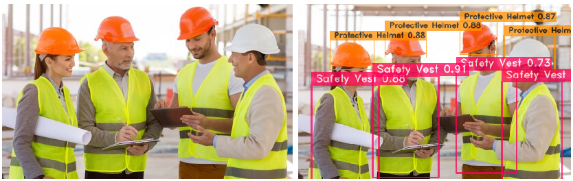

# YOLO-NAS PPE Detection Project

This project aims to detect Personal Protective Equipment (PPE) using the YOLO (You Only Look Once) object detection framework, specifically utilizing the YOLO-NAS-M model architecture.

## YOLO-NAS Model Architecture

YOLO-NAS is one of the State-of-The-Art architecture for object detection. It outperforms YOLOv8 (previous object detection SoTA) as shown on the image below. It's also 10-20% faster than YOLOv8 and YOLOv7.

## Dataset

The dataset used for the training of the model is taken from [Roboflow Universe](https://universe.roboflow.com/project-uyrxf/ppe_detection-v1x3l). The reasons this dataset is used are:
- It has labels for relevant objects for this task which includes **Protective Boots**, **Protective Helmet**, **Safety Vest**, **Eye Wear**, **Glove**, **Dust Mask**, and **Face Shield**.
- The number of labels is moderate (7) compared to other datasets.
- Almost all of the classes are balanced except for **Eye Wear**, and **Face Shield**.
- It has a moderate number of images (3290 images) which enough for creating a good detector while not being too heavy to train on.
- It includes a lot of images taken from CCTV video of people wearing PPE.

## Image Augmentation

To improve the model's robustness and generalization capabilities, several image augmentation techniques were applied to the dataset. These techniques include:

- **Horizontal Flipping**: Images were flipped horizontally to diversify the dataset and reduce the risk of overfitting.
- **Random Rotation**: Random rotation within a certain degree range was applied to simulate variations in the orientation of individuals wearing PPE.
- **Brightness and Contrast Adjustment**: Changes in brightness and contrast were introduced to mimic different lighting conditions.
- **Scaling and Cropping**: Random scaling and cropping were performed to augment the dataset with variations in PPE object sizes and positions.
- **Translation**: Random translation of images horizontally and vertically was applied to simulate variations in PPE object positions and perspectives.
- **Shearing**: Random shearing was performed to introduce angular distortions, mimicking real-world scenarios where PPE objects may appear skewed from different viewpoints.
- **Mixup**: Mixup augmentation involves blending pairs of images and their corresponding labels to generate new samples. This method is used to make sure that the model can learn from interpolated data points to improve its generalization ability.

## Result

- **Precision@0.50**: 0.18
- **Recall@0.50**: 0.97
- **mAP@0.50**: 0.87
- **F1@0.50**: 0.29
- **Best_score_threshold**: 0.44

The notebook used for training can be seen in the `notebook/` folder. Detection on a sample video can be seen [here](https://drive.google.com/file/d/1WKYQf5nEr2_8qMp6I4t32BjfLzX2q1ng/view?usp=sharing).

## Usage

To run the app locally:
- Clone the repository.
- Install the necessary dependencies with `pip install -r requirements.txt` in a virtual environment.
- Download the model from [here](https://drive.google.com/file/d/1-VJy9fLKiPazJT_pyedrE4JUzISL1zpZ/view?usp=sharing).
- Put the model inside the `models/` folder and name it `ckpt_best_yolonas.pth`
- Run `streamlit run app.py` to run the application.
- Open your default browser to use the application.

The app can also be accessed through the web from [here](https://huggingface.co/spaces/Hanifahreza/detektor-apd).
